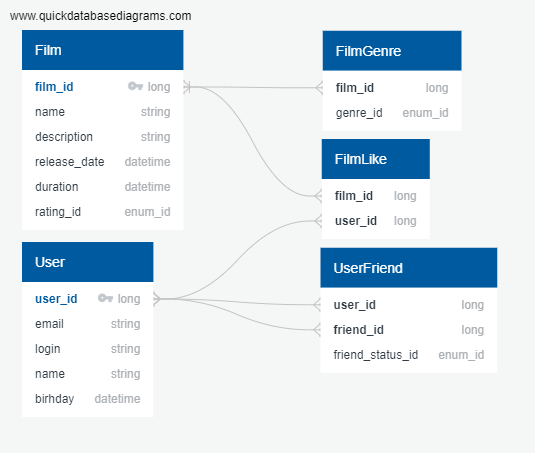

# java-filmorate

Simple Filmorate project.

DB table structure and relationships

Table: Film

Таблица для хранения данных о фильмах, первичный ключ film_id.
Поле rating_id содержит индекс перечисления рейтингов

| column_name   | column_type | column_keys |
|---------------|-------------|-------------|
| film_id       | long        | PK          |
| name          | string      |             |
| description   | string      |             |
| release_date  | datetime    |             |
| duration      | datetime    |             |
| rating_id     | enum_id     |             |

Table: User

Таблица для хранения пользователей, первичный ключ user_id

| column_name | column_type | column_keys |
|-------------|-------------|-------------|
| user_id     | long        | PK          |
| email       | string      |             |
| login       | string      |             |
| name        | datetime    |             |
| birthday    | datetime    |             |

Table: FilmLike

Таблица для хранения лайков, отношения с таблицами фильмов и пользователей
многие ко многим по внешним ключам

| column_name | column_type | column_keys         |
|-------------|-------------|---------------------|
| film_id     | long        | FK >-< Film.film_id |
| user_id     | long        | FK >-< User.user_id |

Table: FilmGenre

Таблица для хранения жанров фильмов многие к одному к таблице фильмов.
genre_id хранит индекс перечисления жанров

| column_name | column_type | column_keys         |
|-------------|-------------|---------------------|
| film_id     | long        | FK  >- Film.film_id |
| genre_id    | enum_id     |                     |

Table: UserFriend

Таблица для хранения друзей. Многие ко многим с таблицей пользователей.
Поле friend_status_id хранит индекс перечисления статусов

| column_name      | column_type | column_keys          |
|------------------|-------------|----------------------|
| user_id          | long        | FK  >-< User.user_id |
| friend_id        | long        | FK >-< User.user_id  |
| friend_status_id | enum_id     |                      |
